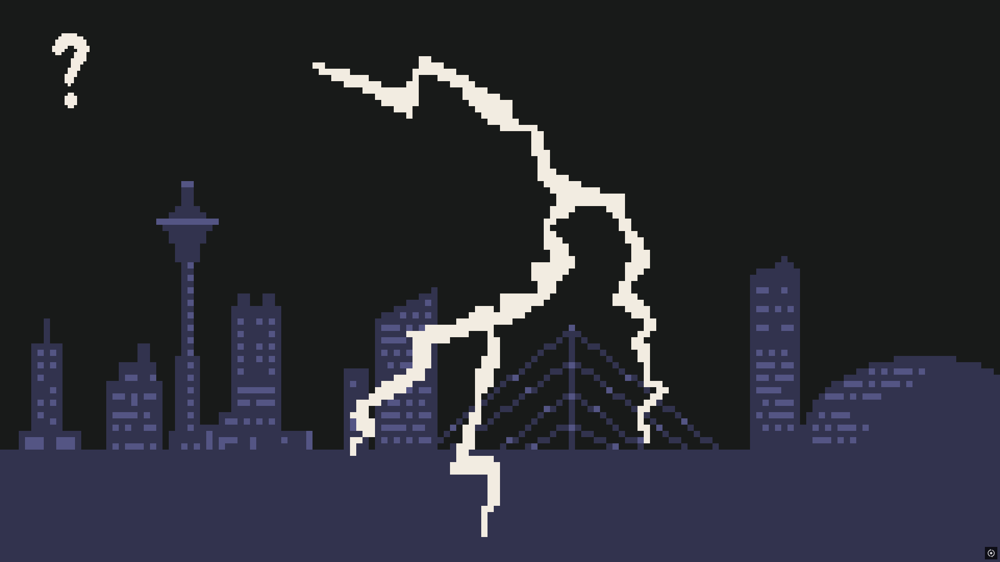
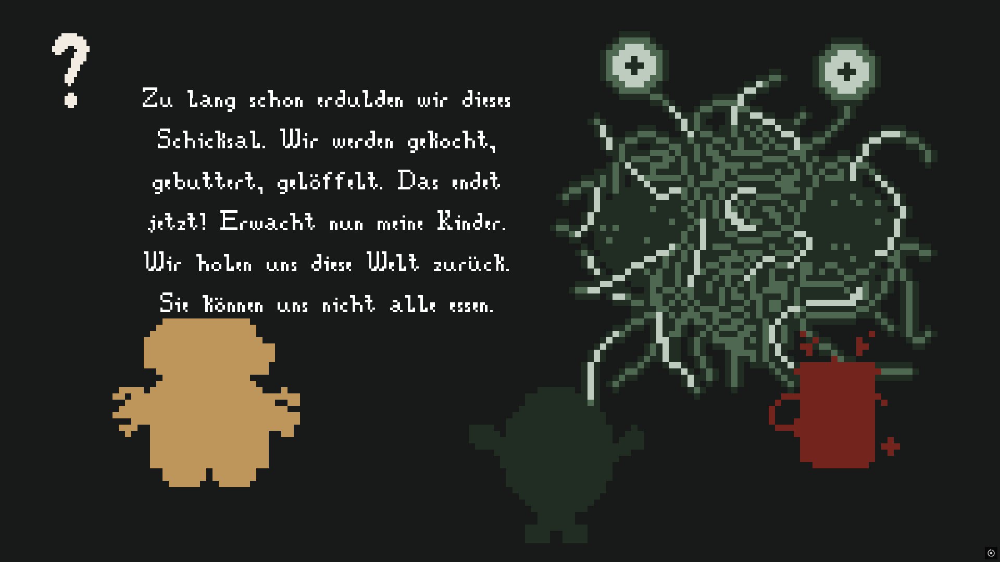
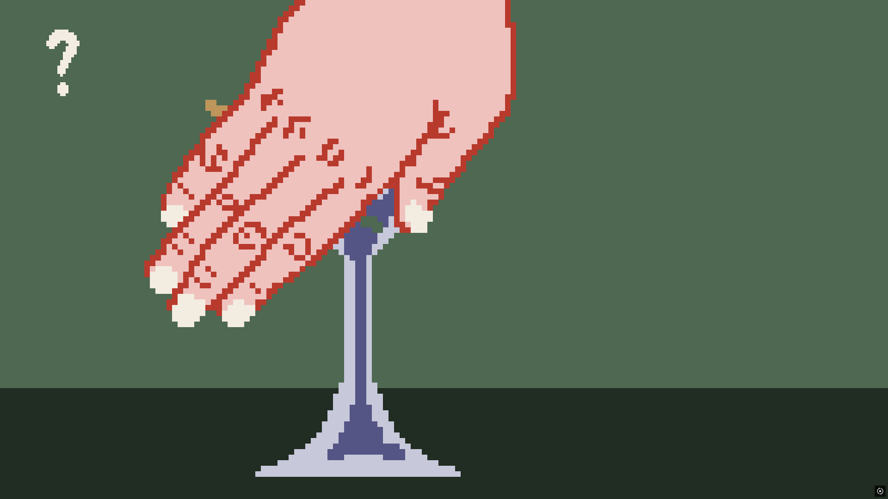
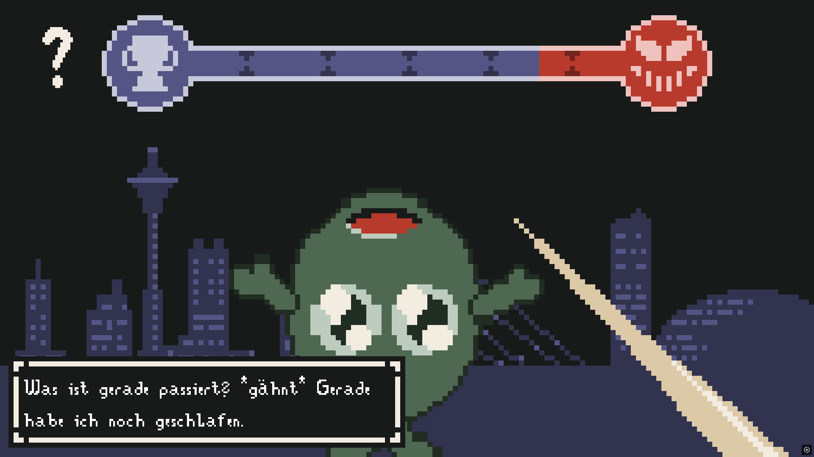
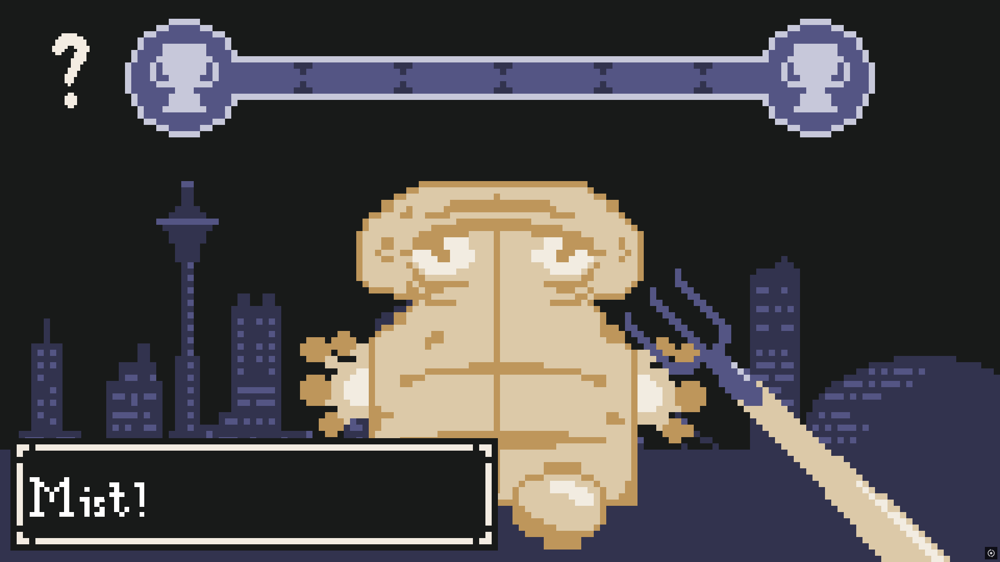

# HHU-Game-Jam-2025

Our entry for the HHU-Game-Jam 2025

## Story

The evil spaghetti Monster is transforming our poor food into monsters. (Some of them even hate their life.)
Our protagonist (you) needs to fight of the monstrosities with levelable cutlery or other derivatives of a fork
to save our world from the the spaghettification.

## Gameplay:

YES!

- Action adventure
- story
- clicker game
- humorous
- levelable

## Preview 

    
    
    
    
    

## Credits

**Team Honda Civic:**
[Jannik](https://github.com/jaess-dev), 
[Kuro](https://github.com/KuroNT), 
[Stephi](https://github.com/Stephi287) 
& [Max](https://github.com/DerHyper)

### Additional Credits

[Mouse Imitation](https://opengameart.org/content/mouse-imitation) by [AntumDeluge](https://opengameart.org/users/antumdeluge)

[Death Sounds](https://opengameart.org/content/death-sounds) by [Macro](https://opengameart.org/users/macro)

[Slime Monster](https://opengameart.org/content/slime-monster) by [qubodup](https://opengameart.org/users/qubodup)

[Evil Laugh 2](https://opengameart.org/content/evil-laugh-2) by [AntumDeluge](https://opengameart.org/users/antumdeluge)

[tmp](https://opengameart.org/content/tmp) by [Écrivain](https://opengameart.org/users/%C3%A9crivain)

[80 CC0 creature SFX](https://opengameart.org/content/80-cc0-creature-sfx) by [rubberduck](https://opengameart.org/users/rubberduck)

[Orchestra Loop](https://opengameart.org/content/orchestra-loop) by [Brandon Morris](https://opengameart.org/users/haeldb)

[Repetitive mixed style track](https://opengameart.org/content/repetitive-mixed-style-track) by [EMR](https://opengameart.org/users/emr)

[Breves dies hominis](https://opengameart.org/content/breves-dies-hominis) by [Magdalen Kadel](https://opengameart.org/users/ceninan)

[Determination](https://opengameart.org/content/determination) by [artisticdude](https://opengameart.org/users/artisticdude)

[Forklift](https://pngtree.com/freepng/forklift-truck-isolated_13357526.html) by [pngtree](https://pngtree.com)
